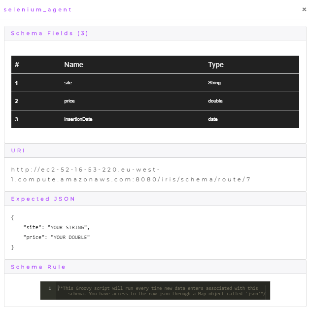
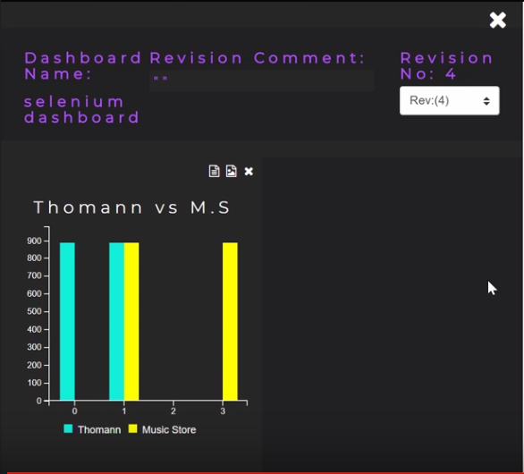

    

        
    

# Iris Selenium Agent

This repository contains the [Selenium](https://www.seleniumhq.org/) agent for my final year project [Iris](https://github.com/DeanGaffney/iris). The Selenium agent was written in Java using a Selenium wrapper library called [Selenide](https://selenide.org/). This agent demonstrates the versatility of Iris by using Selenium to scrape guitar prices from two music store websites [Thomann](https://www.thomann.de/ie/index.html) and [MusicStore](https://www.musicstore.de). The scraped prices are then pushed into Iris and the prices are displayed on an Iris dashboard chart in real time.

## Agent Schema
The following is the schema that was created in Iris for the agent.

## Agent Dashboard
The following image shows the dashboard for the agent inside Iris where it is keeping track of guitar prices.

## Video Demonstration

[Iris Selenium Agent Demo](https://youtu.be/n2G9Do_DZgI)

## Other Iris agents
* [Android](https://github.com/DeanGaffney/iris-android)
* [Node.js](https://github.com/DeanGaffney/iris-node)
* [MySQL](https://github.com/DeanGaffney/iris-mysql)
* [Crypto Currency Rates](https://github.com/DeanGaffney/iris-crypto-rates)

## Built With

- Java 8
- Selenide
- Selenium
- Firefox
- Gecko Driver

## Authors

* **Dean Gaffney**

See also the list of [contributors](https://github.com/DeanGaffney/iris-selenium/graphs/contributors) who participated in this project.